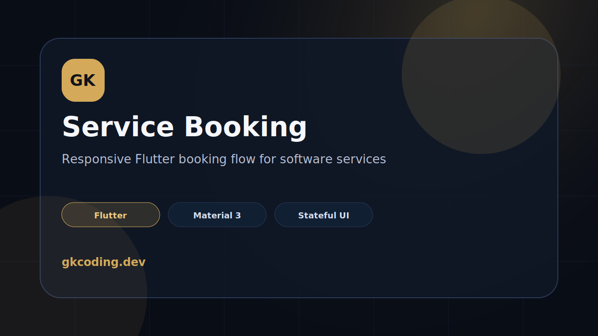

# GK Flutter Service Booking



Responsive Flutter demo app by **GK Coding**.

This project demonstrates a real service booking flow for software businesses: service selection, appointment slot picking, pricing summary, and conversion-focused UI.

## Features

- Flutter Material 3 app
- Responsive desktop/mobile layout
- Stateful service selection
- Slot picker interaction
- Premium dark/gold GK Coding style
- Conversion-oriented booking summary

## Tech

`Flutter` · `Dart` · `Material 3`

## Run

```bash
flutter pub get
flutter run -d chrome
```

## Verify

```bash
flutter build web
```

## Purpose

Portfolio/demo project for showing product UI, responsive layout, and state handling.
